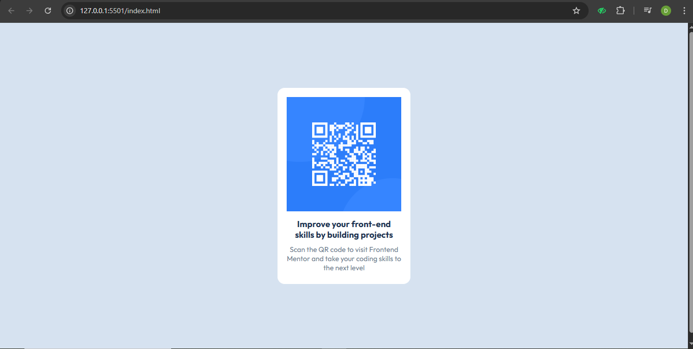

# Frontend Mentor - QR code component solution

This is my solution to the [QR code component challenge on Frontend Mentor](https://www.frontendmentor.io/challenges/qr-code-component-iux_sIO_H).

## Table of contents

- [Overview](#overview)
  - [Screenshot](#screenshot)
  - [Links](#links)
- [My process](#my-process)
  - [Built with](#built-with)
  - [What I learned](#what-i-learned)
- [Author](#author)

## Overview

### Screenshot

### Links

- Solution URL: http://127.0.0.1:5501/index.html
- Live Site URL: [Add your live site URL here]

## My process

### Built with

- Semantic HTML5
- CSS Flexbox
- Mobile-first workflow
- Google Fonts (Outfit)

### What I learned

- How to use Flexbox for centering content both vertically and horizontally.
- How to use custom fonts from Google Fonts.
- Improved my understanding of responsive design and card layouts.

